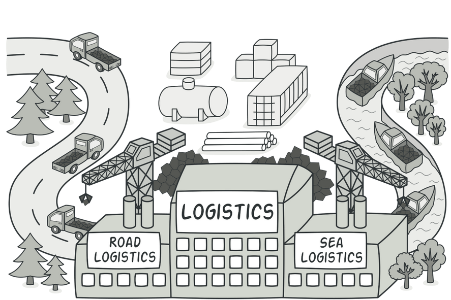

## Examples of using factory:
* When you don’t know beforehand the exact types and dependencies of the objects your code should work with.
* When you want to provide users of your library or framework with a way to extend its internal components.
* When you want to save system resources by reusing existing objects instead of rebuilding them each time.
### Factory on image:
