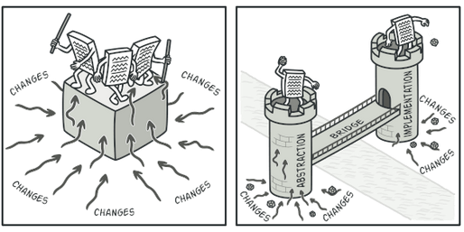

## Bridge pattern using examples:
* You want to divide and organize a monolithic class that has several variants of some functionality (for example, if the class can work with various database servers).
* You need to extend a class in several orthogonal (independent) dimensions.
* You need to be able to switch implementations at runtime.
* 