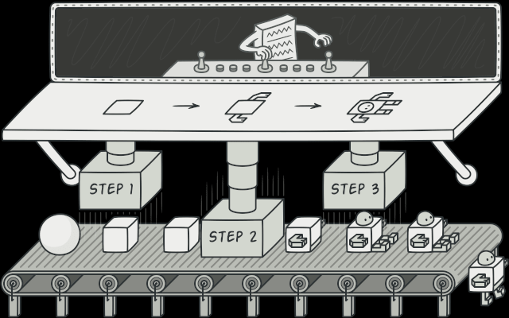
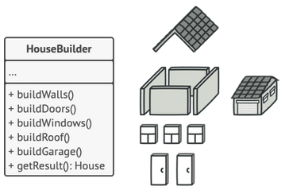

## Builder using examples:
* Instead of constructor with a lot of parameters
* Get rid of a “telescoping constructor”.
* When you want your code to be able to create different representations of some product (for example, stone and wooden houses).
* Construct objects step-by-step
### Builder on image:

### House builder:
