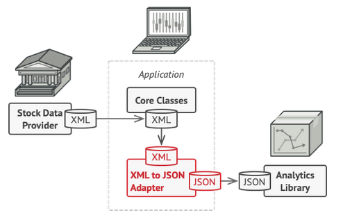

## Adapter pattern using examples:
* Converts the interface of one object so that another object can understand it.
* Different power plug in countries, use power plug adapter, that allows use all plug types
* You want to use some existing class, but its interface isn’t compatible with the rest of your code.
* You want to reuse several existing subclasses that lack some common functionality that can’t be added to the superclass.
### Image:
