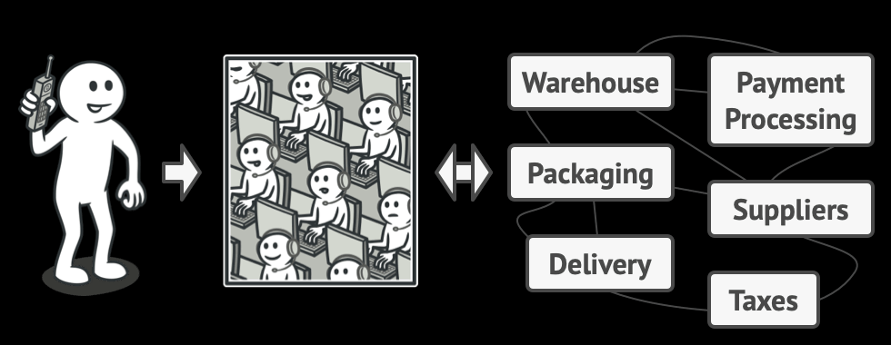

## Examples of using Facade pattern:
* Place a phone order, an operator is your facade to all services and departments of the shop
* You need to have a limited but straightforward interface to a complex subsystem.
* You want to structure a subsystem into layers.
### Image:
