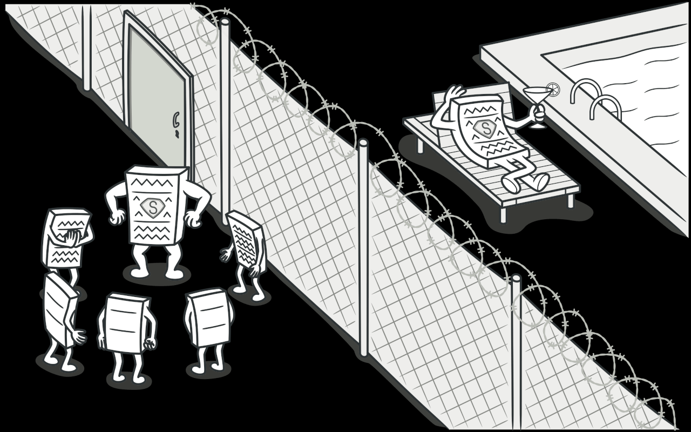

## Examples of using Proxy pattern:
* Credit cards can be used for payments just the same as cash. (credit card is a proxy for a bank account)
* Lazy initialization. You have a heavyweight service object that wastes system resources by being always up, even though you only need it from time to time.
* Access control (protection proxy). You want only specific clients to be able to use the service object; for instance, when your objects are crucial parts of an operating system and clients are various launched applications (including malicious ones).
* Local execution of a remote service (remote proxy). Service object is located on a remote server.
* Logging requests (logging proxy). You want to keep a history of requests to the service object.
* Caching request results (caching proxy). You need to cache results of client requests and manage the life cycle of this cache, especially if results are quite large.
* 
### Image:
